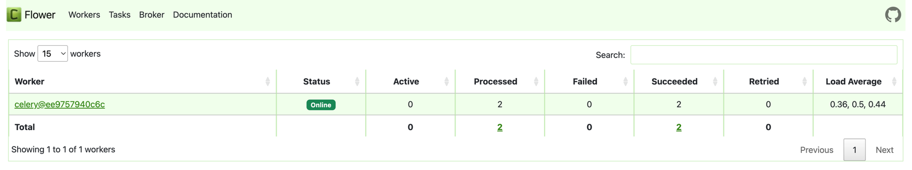
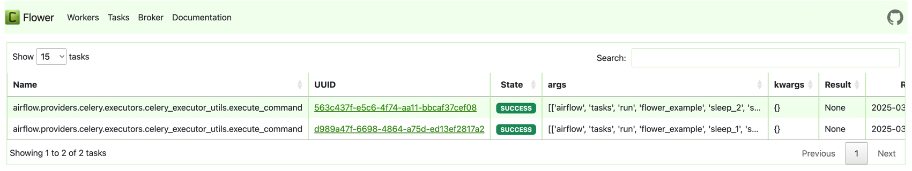

# Flower

Flower: Celery 모니터링 및 관리 도구

[Documentation](https://flower.readthedocs.io/en/latest/)

Flower is a web-based monitoring tool used to monitor and manage Celery clusters.  
- Flower는 Celery 클러스터를 모니터링하고 관리하는 웹 기반 도구입니다.

Celery is a distributed task queue system, commonly used for asynchronous task execution in Python applications.
- Celery는 분산 태스크 큐 시스템으로, Python 애플리케이션에서 비동기 태스크 실행에 자주 사용됩니다.


주요 기능

- View the status of Celery workers: Flower provides a dashboard that displays information about each Celery worker, such as the number of tasks processed, their runtime, and any errors encountered.
  - Celery 워커 상태 확인: Flower는 각 Celery 워커의 대시보드를 제공하여, 처리한 태스크 수, 실행 시간, 발생한 오류 등의 정보를 확인할 수 있습니다.
- Inspect active tasks: Flower allows you to see the details of currently active tasks, including their arguments, execution time, and progress.
  - 실행 중인 태스크 확인: 현재 실행 중인 태스크의 세부 정보(입력 인자, 실행 시간, 진행 상황) 등을 실시간으로 조회할 수 있습니다.
- Analyze task history: You can access historical data on completed tasks, enabling you to analyze task performance over time.
  - 태스크 이력 분석: 완료된 태스크의 기록을 확인하고 분석하여, 장기적인 태스크 성능을 평가할 수 있습니다.
- Monitor Celery queues: Flower lets you observe the status of Celery queues and the tasks waiting to be processed.
  - Celery 큐 모니터링: Celery 큐의 상태 및 대기 중인 태스크 목록을 확인할 수 있습니다.
- Manage Celery workers: You can start, stop, and restart Celery workers directly from the Flower web interface.
  - Celery 워커 관리: Flower 웹 인터페이스에서 Celery 워커를 직접 시작, 중지, 재시작할 수 있습니다.


```
docker compose --profile flower up
```




