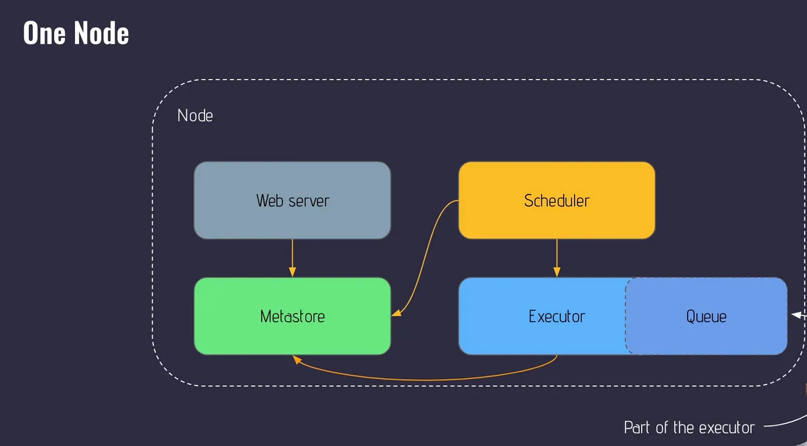
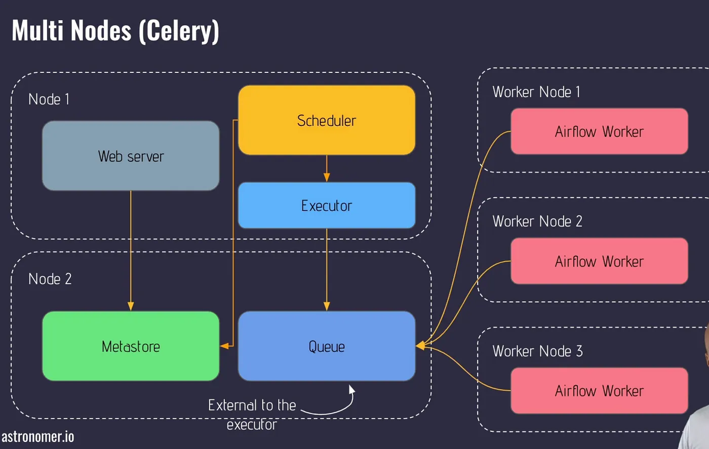
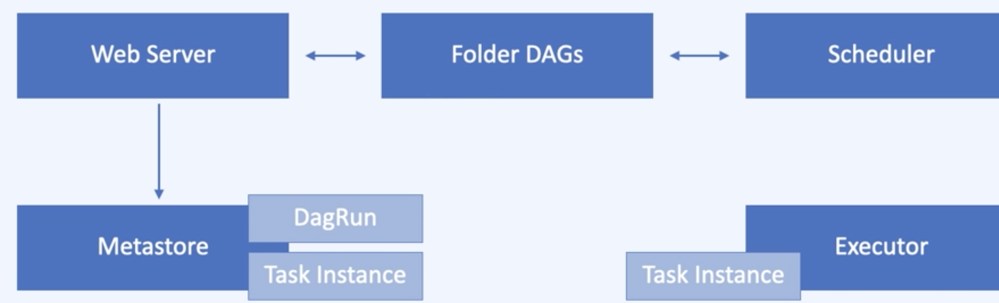

# Architecture

## Single or Multi node

### Single node

https://medium.com/@kanikaadik07/airflow-introductory-lifecycle-of-a-dag-9991afb79535

1. 크게 4가지의 모듈로 나눌 수 있다.
2. 메타스토어가 DAG의 정보를 담고있다.
3. 웹서버와 스케줄러는 이런 정보를 읽어오고 Executor로 보내 실행시킨다.
4. 이렇게 실행된 DAG의 task instance는 메타스토어로 다시 보내져서 상태를 업데이트한다.
5. 업데이트된 상태를 웹서버와 스케줄러가 읽어와서 task가 완료됐는지 확인한다.
6. executor안에는 Queue라는 것이 존재해서 task의 순서를 정한다.

### Multi nodes

https://medium.com/@kanikaadik07/airflow-introductory-lifecycle-of-a-dag-9991afb79535

1. Queue가 Executor 바깥에 존재 (Celery Broker = One node architecture의 Queue와 동일)
2. Airflow UI 와 스케줄러가 SQL store(메타스토어)의 메타정보를 읽어온다.
3. 읽어온 정보를 Celery Broker에 순서대로 담는다.
4. 순서대로 담긴 task를 worker들이 실행한다.
5. 완료된 후에는 SQL store, celery executor에 보고되고 스케줄러가 완료된것을 확인한다.

## 동작방식

1. DAG를 작성하여 Workflow를 만든다. DAG는 Task로 구성되어있다.
2. Task는 Operator가 인스턴스화 된것.
3. DAG를 실행시킬때 스케줄러는 DagRun 오브젝트를 만든다.
4. DagRun 오브젝트는 Task Instance를 만든다.
5. Worker가 Task를 수행 후 DagRun의 상태를 "완료"로 바꿔놓는다.

## DAG의 생성과 실행

1. 유저가 새로운 DAG를 작성 후 Folder DAGs 안에 배치
2. 웹서버와 스케줄러가 DAG를 파싱
3. 스케줄러가 메타스토어를 통해 DagRun 오브젝트를 생성
4. DagRun은 사용자가 작성한 DAG의 인스턴스
5. DagRun status: Running
6. 스케줄러는 Task Instance 오브젝트를 스케줄링 (DagRun 오브젝트의 인스턴스 = Task Instance)
7. 스케줄러가 Task Instance를 Executor로 보냄.
8. 완료 후 Executor는 메타스토어에 완료했다고 보고.
9. 스케줄러는 DAG 실행이 완료 됐나 확인.
10. DagRun status: Completed
11. 웹서버가 메타스토어 정보를 읽어 UI 업데이트

