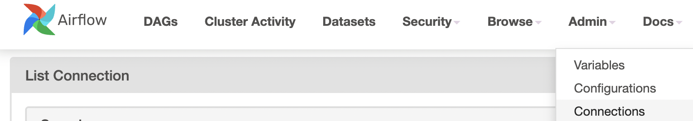
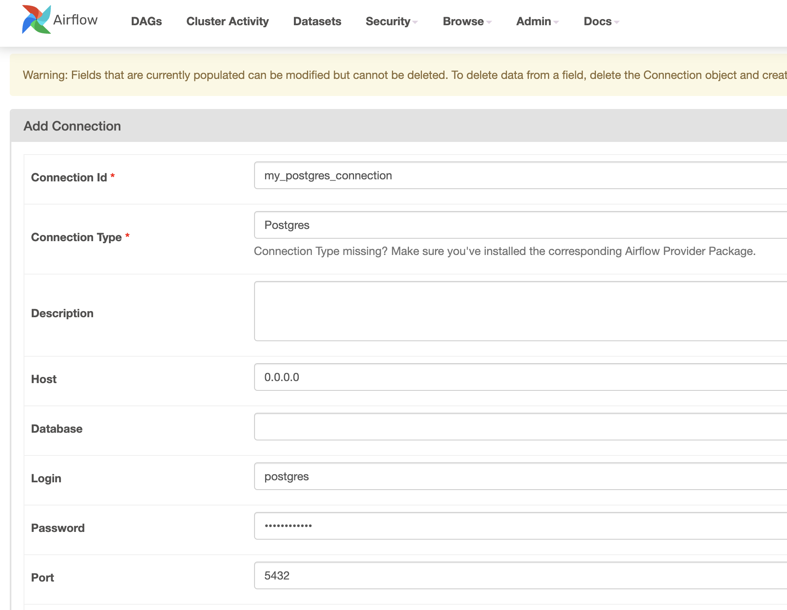

# Providers

[Providers packages reference](https://airflow.apache.org/docs/apache-airflow-providers/packages-ref.html)


Airflow provider refers to a specific implementation or integration of functionality within Airflow.
- Airflow 내에서 특정 기능을 구현하거나 통합하는 구성 요소를 의미

Providers allow Airflow to support and interact with different external systems, services, or technologies.
- Airflow가 다양한 외부 시스템, 서비스 또는 기술과 상호 작용할 수 있도록 지원

Airflow’s modular architecture enables the inclusion of various providers, which extend its capabilities beyond the core functionality. Providers typically include operators, hooks, sensors, and other components tailored to interact with a specific system or service. (>= 2.0, a.k.a. contrib before)
- Airflow의 모듈식 아키텍처는 여러 제공자를 포함할 수 있도록 하여 핵심 기능을 넘어 확장할 수 있도록 한다 
- 일반적으로 특정 시스템이나 서비스와 상호 작용할 수 있도록 설계된 연산자(Operator), 후크(Hook), 센서(Sensor) 및 기타 구성 요소를 포함
- (버전 2.0 이상에서는 “Provider”로 불리며, 이전에는 “contrib”로 불렸음)


## Postgres Example

[postgres_loader.py](../install/on-premise/airflow/dags/postgres_loader.py)

```bash
pip install apache-airflow-providers-postgres
```

### run postgresql

docker compose up -d 

```yml
version: "3.9"

services:
  db:
    image: postgres:13.6
    restart: always
    environment:
      POSTGRES_DATABASE: postgres
      POSTGRES_USER: postgres
      POSTGRES_PASSWORD: password1234
    ports:
      - "5432:5432"
```

### run ddl query

```sql
-- create table
CREATE TABLE public.sample_table (
    id SERIAL PRIMARY KEY,
    key VARCHAR(50) NOT NULL,
    value VARCHAR(50) NOT NULL
);

-- show table schema
SELECT  
    table_name,  
    column_name,  
    data_type  
FROM  
    information_schema.columns  
WHERE  
    table_name = 'sample_table';
```

### run test 

```bash
airflow tasks test postgres_loader execute_sql_query 2023-01-01
```






## Trouble shoot

https://github.com/apache/airflow/issues/26431

