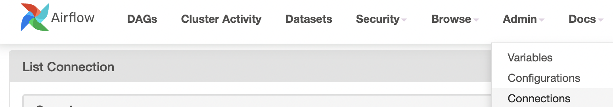
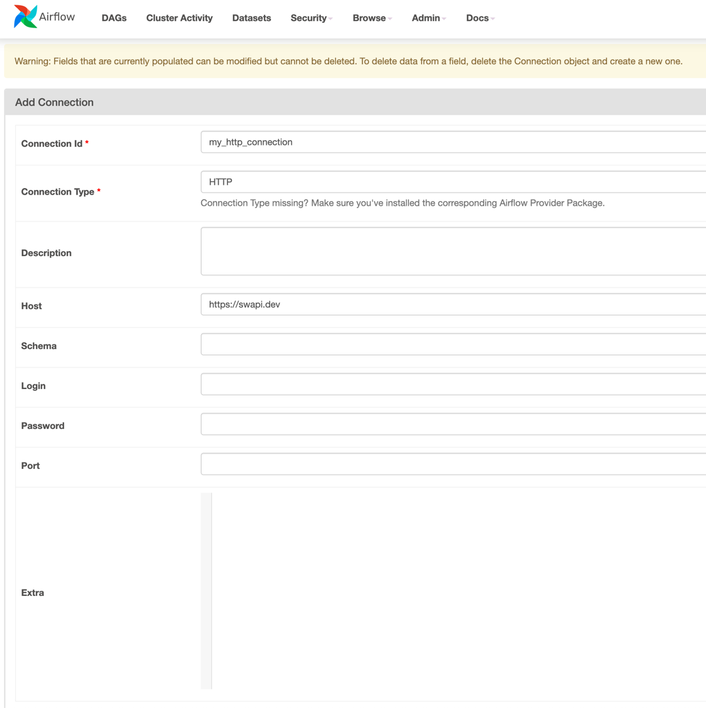
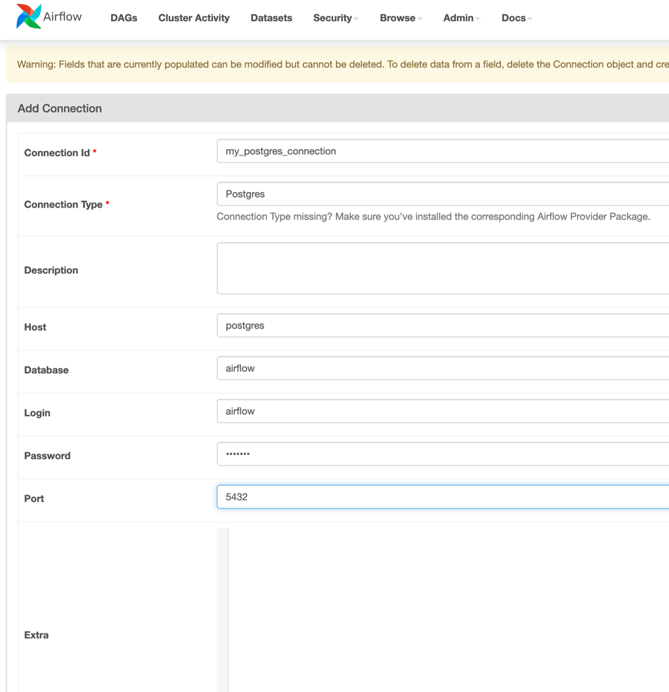
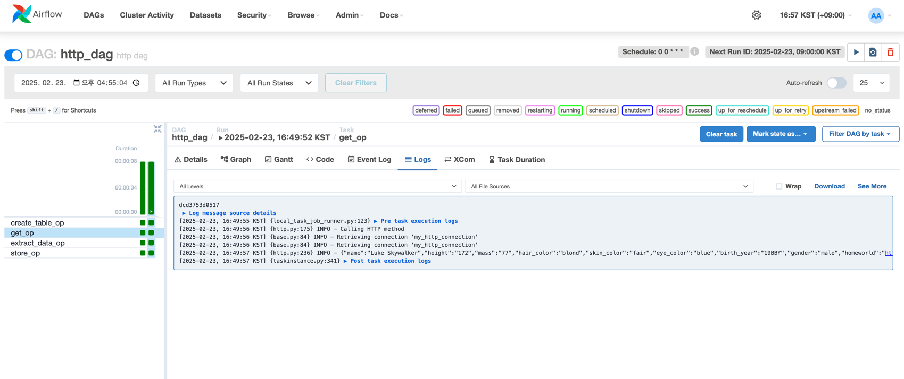

# [Hook](https://airflow.apache.org/docs/apache-airflow/stable/authoring-and-scheduling/connections.html#hooks)

A Hook is a high-level interface to an external platform  
- Hook은 외부 플랫폼과 상호작용할 수 있는 고수준 인터페이스로,

that lets you quickly and easily talk to them without having to write low-level code that hits their API or uses special libraries.  
- 해당 API를 직접 호출하거나 특정 라이브러리를 사용하지 않고도 쉽고 빠르게 통신할 수 있도록 도와줍니다.

They’re also often the building blocks that Operators are built out of.
- 또한, 종종 Operator를 구성하는 기본 요소로 사용되기도 합니다.

## Example

[http-dag.py](../install/docker/dags/http-dag.py)

PostgresOperator(create a table) -> SimpleHttpOperator(get API data - https://swapi.dev/) -> PythonOperator(extract data) -> PythonOperator(store data using hook) -> PostgreSQL

### on docker config

edit docker-compose.yml
```
services:
  postgres:
    ports:
      - 5432:5432

x-airflow-common:
  environment:
    AIRFLOW__CORE__LOAD_EXAMPLES: 'false'
    _PIP_ADDITIONAL_REQUIREMENTS: ${_PIP_ADDITIONAL_REQUIREMENTS:- apache-airflow-providers-postgres}
```
 
### Connection config







### Run debug

get op log


container debug

```
docker exec -it docker-airflow-worker-1 bash

cat /tmp/starwars_character.csv
# Luke Skywalker,172,77
```
