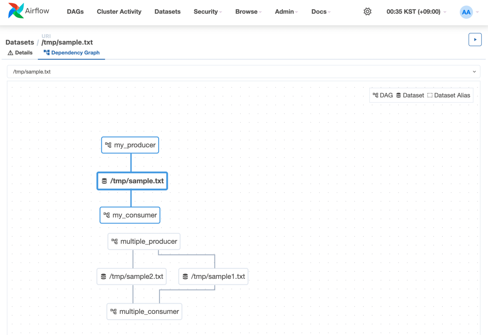

# Scheduling

The Airflow scheduler monitors all tasks and all DAGs and triggers the task instances whose dependencies have been met. Behind the scenes, it monitors and stays in sync with a folder for all DAG objects it may contain and periodically (every minute or so) inspects active tasks to see whether they can be triggered.
- Airflow 스케줄러는 모든 태스크와 모든 DAG를 모니터링
- 의존성이 충족된 태스크 인스턴스를 트리거
- 백그라운드에서는 모든 DAG 객체가 포함될 수 있는 폴더를 지속적으로 모니터링하고 동기화 상태를 유지
- 주기적으로(약 1분마다) 활성 태스크를 검사하여 트리거할 수 있는지 확인

Note that if you run a DAG on a schedule_interval of one day, the run stamped 2023-01-01 will be triggered soon after 2023-01-01T23:59. In other words, the job instance is started once the period it covers has ended.
- 만약 DAG를 하루 단위(schedule_interval)로 실행할 경우
  - 2023-01-01로 표시된 실행은 2023-01-01T23:59 직후에 트리거
  - 다시 말해, 해당 기간이 종료된 후에 작업 인스턴스가 시작

The scheduler runs your job one schedule_interval AFTER the start date, at the END of the period.
  - 스케줄러는 시작일로부터 하나의 schedule_interval 이후에 작업을 실행
  - 기간이 끝나는 시점에 작업을 시작

start_date + schedule_interval = execute time


## Dag Schedule Interval

| **Preset**  | **Meaning**                                              | **Cron Expression** |
|-------------|----------------------------------------------------------|---------------------|
| `None`      | Don't schedule, use for exclusively "externally triggered" DAGs | -                   |
| `once`      | Schedule once and only once                              | -                   |
| `@hourly`   | Run once an hour at the beginning of the hour            | `0 * * * *`         |
| `@daily`    | Run once a day at midnight                               | `0 0 * * *`         |
| `@weekly`   | Run once a week at midnight on Sunday morning            | `0 0 * * 0`         |
| `@monthly`  | Run once a month at midnight on the first day of the month| `0 0 1 * *`         |
| `@yearly`   | Run once a year at midnight of January 1                 | `0 0 1 1 *`         |


## Backfill & Catch up

An Airflow DAG with a start_date, possibly an end_date, and a schedule_interval defines a series of intervals which the scheduler turns into individual Dag Runs and executes.
- Airflow의 DAG는 start_date(시작일), 필요에 따라 end_date(종료일), 그리고 schedule_interval(스케줄 간격)을 통해 여러 구간을 정의
- 스케줄러는 이를 개별 Dag Run으로 변환하여 실행

A key capability of Airflow is that these DAG Runs are atomic and idempotent items.
- Airflow의 핵심 기능 중 하나는 이러한 DAG Run이 **원자적(atomic)**이고 **멱등성(idempotent)**을 가진다는 점

By default, the scheduler will examine the lifetime of the DAG (from start to end/now, one interval at a time) and kick off a DAG Run for any interval that has not been run (or has been cleared). This concept is called Catchup.
- 기본적으로 스케줄러는 DAG의 전체 기간(시작일부터 종료일/현재 시점까지)을 하나의 구간씩 확인
- 실행되지 않았거나 초기화된 구간에 대해 새로운 DAG Run을 시작
- 이 개념을 **캐치업(Catchup)**이라고 함

catch up example

```
with DAG('http_dag',
         description='http dag',
         schedule_interval='0 0 * * *',
         start_date=datetime(2023, 7, 1),
         catchup=False) as dag:
```

## DATA-AWARE SCHEDULING

[Airflow Documentation - Datasets](https://airflow.apache.org/docs/apache-airflow/stable/authoring-and-scheduling/datasets.html)

Added in version 2.4.  

In addition to scheduling DAGs based on time, you can also schedule DAGs to run based on when a task updates a dataset.

```
from airflow.datasets import Dataset

with DAG(...):
    MyOperator(
        # this task updates example.csv
        outlets=[Dataset("s3://dataset-bucket/example.csv")],
        ...,
    )

with DAG(
    # this DAG should be run when example.csv is updated (by dag1)
    schedule=[Dataset("s3://dataset-bucket/example.csv")],
    ...,
):
```

### Dataset?

An Airflow dataset is a stand-in for a logical grouping of data. 
- Airflow 데이터셋은 논리적으로 그룹화된 데이터를 나타내는 대체 개념

Datasets may be updated by upstream “producer” tasks, and dataset updates contribute to scheduling downstream “consumer” DAGs.
- 데이터셋은 upstream의 “프로듀서(producer)” 태스크에 의해 업데이트될 수 있으며, 
- 이러한 데이터셋의 업데이트는 downstream의 “컨슈머(consumer)” DAG들의 스케줄링에 영향

Producer Dataset

```python
from airflow import DAG
from airflow.datasets import Dataset
from airflow.operators.bash import BashOperator
from datetime import datetime

# Define the dataset
local_file = Dataset("/tmp/sample.txt")

# Define the DAG
with DAG(
    dag_id="my_producer",
    schedule_interval="0 * * * *",  # Runs at the start of every hour
    start_date=datetime(2023, 7, 1),
    catchup=False
) as dag:

    # Define the producer task
    task_producer = BashOperator(
        task_id="producer1",
        bash_command='echo "hello world" >> /tmp/sample.txt',
        outlets=[local_file]  # Specify the dataset as the output
    )
```

Consumer Dataset

```python
from airflow import DAG
from airflow.datasets import Dataset
from airflow.operators.bash import BashOperator
from datetime import datetime

# Define the dataset
local_file = Dataset("/tmp/sample.txt")

# Define the DAG
with DAG(
    dag_id="my_consumer",
    schedule=[local_file],  # Triggers when the dataset is updated
    start_date=datetime(2023, 7, 1),
    catchup=False
) as dag:

    # Define the consumer task
    task_consumer = BashOperator(
        task_id="consumer1",
        bash_command='cat /tmp/sample.txt'
    )
```

### 주의사항

Whenever a task responsible for updating datasets successfully completes, it triggers the execution of Consumer DAGs. 
However, Airflow does not verify if the data has indeed been updated.
- 데이터셋을 업데이트하는 태스크가 성공적으로 완료되면 Consumer DAG이 실행
- 하지만 Airflow는 실제로 데이터가 업데이트되었는지 여부는 확인하지 않음

Combination with a regular schedule is not supported.
- 일반적인 스케줄과의 조합은 지원되지 않음

When multiple tasks update the same dataset, the completion of one task immediately triggers the Consumer DAG without waiting for the second task to finish.
- 여러 태스크가 동일한 데이터셋을 업데이트할 때, 하나의 태스크가 완료되면 나머지 태스크가 끝나기를 기다리지 않고 Consumer DAG이 즉시 트리거 됨

Airflow only tracks datasets within the scope of DAGs and tasks. 
If an external tool modifies the underlying data associated with a dataset, Airflow lacks the capability to detect those changes.
- Airflow는 DAG와 태스크의 범위 내에서만 데이터셋을 추적
- 외부 도구가 데이터셋과 연결된 실제 데이터를 수정하는 경우, Airflow는 해당 변경 사항을 감지할 수 없음

### Example

[my_producer.py](../install/docker/dags/my_producer.py)

[my_consumer.py](../install/docker/dags/my_consumer.py)

[multiple_producer.py](../install/docker/dags/multiple_producer.py)

[multiple_consumer.py](../install/docker/dags/multiple_consumer.py)


